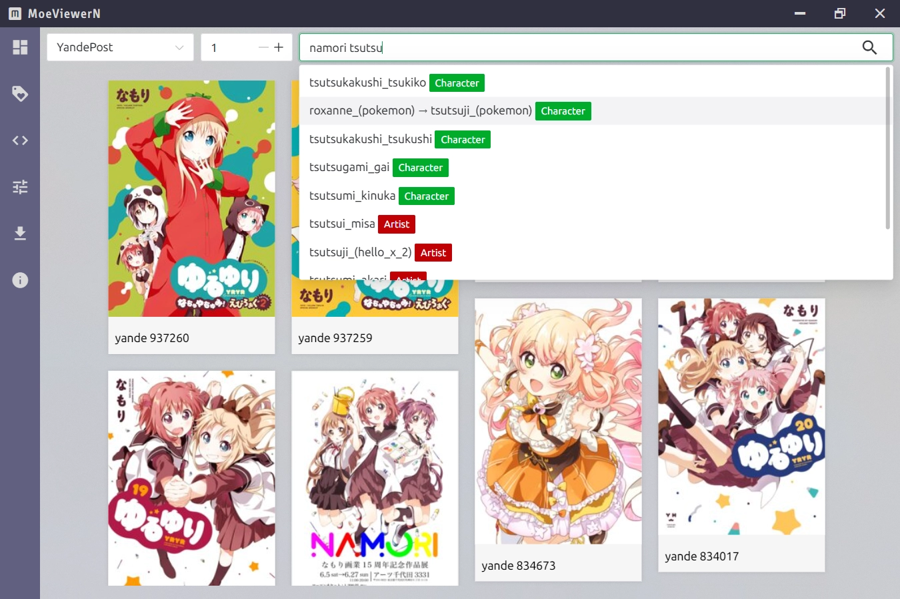

# MoeViewerN

This template should help get you started developing with Vue 3 in Vite.

## Sample


## Recommended IDE Setup

[VSCode](https://code.visualstudio.com/) + [Volar](https://marketplace.visualstudio.com/items?itemName=johnsoncodehk.volar) (and disable Vetur) + [TypeScript Vue Plugin (Volar)](https://marketplace.visualstudio.com/items?itemName=johnsoncodehk.vscode-typescript-vue-plugin).

## Type Support for `.vue` Imports in TS

TypeScript cannot handle type information for `.vue` imports by default, so we replace the `tsc` CLI with `vue-tsc` for type checking. In editors, we need [TypeScript Vue Plugin (Volar)](https://marketplace.visualstudio.com/items?itemName=johnsoncodehk.vscode-typescript-vue-plugin) to make the TypeScript language service aware of `.vue` types.

If the standalone TypeScript plugin doesn't feel fast enough to you, Volar has also implemented a [Take Over Mode](https://github.com/johnsoncodehk/volar/discussions/471#discussioncomment-1361669) that is more performant. You can enable it by the following steps:

1. Disable the built-in TypeScript Extension
    1) Run `Extensions: Show Built-in Extensions` from VSCode's command palette
    2) Find `TypeScript and JavaScript Language Features`, right click and select `Disable (Workspace)`
2. Reload the VSCode window by running `Developer: Reload Window` from the command palette.

## Customize configuration

See [Vite Configuration Reference](https://vitejs.dev/config/).

## (Optional) Use Acrylic Window
### Install all the required tools and configurations using Microsoft's windows-build-tools (only windows) 
```
"electron-acrylic-window": "~0.5.11", 
```

1. `npm install -g windows-build-tools`

2. Download and install [python3](https://www.python.org/downloads/)

## Project Setup
```sh
yarn
```

### Run yarn dev to open vite in browser in development mode.
```sh
yarn dev
```
### Run yarn build to build files and can be served.
```sh
yarn build
```

### Run yarn build to build files and can be served.
```sh
yarn preview
```

### Run yarn electron:dev to work with electron in development mode.
```sh
yarn electron:dev
```

### Run yarn electron:build to build your electron app.
```sh 
yarn electron:build
```


<div align="center"> 
  


A simple starter template for a **Vue3** + **Electron** TypeScript based application, including **ViteJS** and **Electron Builder**.
</div>

## About

This template utilizes [ViteJS](https://vitejs.dev) for building and serving your (Vue powered) front-end process, it provides Hot Reloads (HMR) to make development fast and easy ⚡ 

Building the Electron (main) process is done with [Electron Builder](https://www.electron.build/), which makes your application easily distributable and supports cross-platform compilation 😎

## Getting started

Click the green **Use this template** button on top of the repository, and clone your own newly created repository.

**Or..**

Clone this repository: `git clone git@github.com:Deluze/electron-vue-template.git`


### Install dependencies ⏬

```bash
npm install
```

### Start developing ⚒️

```bash
npm run dev
```

## Additional Commands

```bash
npm run dev # starts application with hot reload
npm run build # builds application

# OR

npm run build:win # uses windows as build target
npm run build:mac # uses mac as build target
npm run build:linux # uses linux as build target
```

Optional configuration options can be found in the [Electron Builder CLI docs](https://www.electron.build/cli.html).
## Project Structure

```bash
- root
  - config/
    - vite.js # ViteJS configuration
    - electron-builder.json # Electron Builder configuration
  - scripts/ # all the scripts used to build or serve your application, change as you like.
  - src/
    - main/ # Main thread (Electron application source)
    - renderer/ # Renderer thread (VueJS application source)
```

## Using static files

If you have any files that you want to copy over to the app directory after installation, you will need to add those files in your `src/main/static` directory.

#### Referencing static files from your main process

```ts
/* Assumes src/main/static/myFile.txt exists */

import {app} from 'electron';
import {join} from 'path';
import {readFileSync} from 'fs';

const path = join(app.getAppPath(), 'static', 'myFile.txt');
const buffer = readFileSync(path);
```
