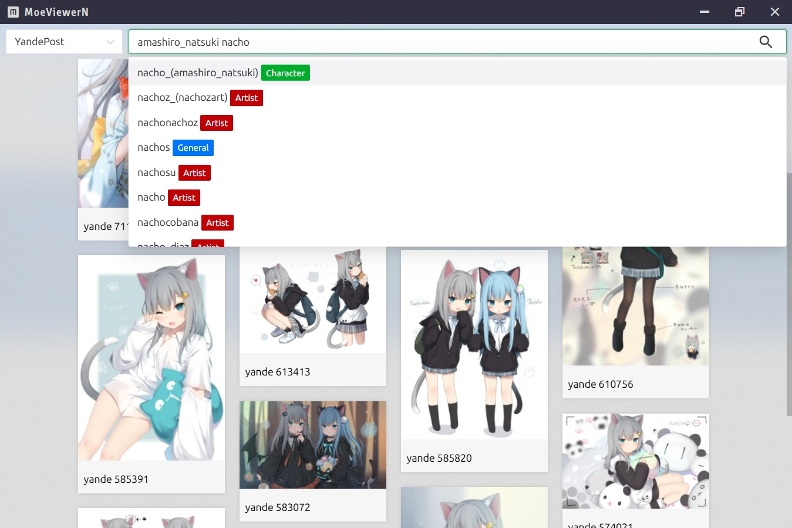

# MoeViewerN
注意：以下是机器翻译的内容

这个模板应该可以帮助你开始在 Vite 中使用 Vue 3 进行开发。 

## 预览


## 推荐的 IDE 设置 

[VSCode](https://code.visualstudio.com/) + [Volar](https://marketplace.visualstudio.com/items?itemName=johnsoncodehk.volar) (和禁用) + [TypeScript Vue Plugin (Volar)](https://marketplace.visualstudio.com/items?itemName=johnsoncodehk.vscode-typescript-vue-plugin).

## 类型支持 TS 中的 .vue 导入 

默认情况下，TypeScript 无法处理 `.vue` 导入的类型信息，因此我们将 `tsc` CLI 替换为 `vue-tsc` 以进行类型检查。在编辑器中，我们需要 [TypeScript Vue Plugin (Volar)](https://marketplace.visualstudio.com/items?itemName=johnsoncodehk.vscode-typescript-vue-plugin) 让 TypeScript 语言服务知道 `.vue` 类型。

如果您觉得独立的 TypeScript 插件不够快，Volar 还实现了性能更高的 [接管模式](https://github.com/johnsoncodehk/volar/discussions/471#discussioncomment-1361669)。 您可以通过以下步骤启用它：

1.禁用内置的TypeScript Extension
  1) 从 VSCode 的命令面板运行 `Extensions: Show Built-in Extensions`
  2) 找到`TypeScript and JavaScript Language Features`，右键选择`Disable (Workspace)`
2. 通过从命令面板运行`Developer: Reload Window` 重新加载 VSCode 窗口。

## 自定义配置

参见 [Vite配置参考](https://vitejs.dev/config/).

## 使用 Microsoft 的 windows-build-tools 安装所有必需的工具和配置（仅限 windows）
```sh
npm install -g windows-build-tools
```

## 项目初始化
```sh
yarn
```

### 运行`yarn dev`以开发模式在浏览器中打开Vite。
```sh
yarn dev
```
### 运行`yarn build`来构建文件并且可以提供服务。
```sh
yarn build
```

### 运行`yarn build`来构建文件并且可以提供服务。
```sh
yarn preview
```

### 运行`yarn electron:dev`以在开发模式下使用电子。
```sh
yarn electron:dev
```

### 运行`yarn electron:build`来构建你的电子应用。
```sh 
yarn electron:build
```
